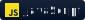
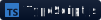
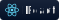
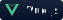
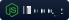
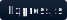
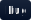
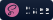
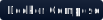
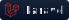

    <h1>Hey there! I'm Erick </h1>

I am a self-taught developer.

## 👨🏻‍💻 &nbsp;About Me

* 🔭 &nbsp; I like to explore new technologies and develop software solutions and quick hacks. 
* 🎓 &nbsp; I am currently studying the last cycles of the Systems Engineering career at the National University of Callao. 
* ✍️ &nbsp; I am on my way to learn more about systems design and software architecture.
* 🎻 &nbsp;  In my free time I like to read books or learn a new musical instrument. 
* ✉️ &nbsp; You can email me at **giancarloaparicio25@gmail.com**! I will try to reply as soon as I can. 
* 📄 &nbsp; You can check my resume to get more information about me. I am open to comments and suggestions!

### 🛠 &nbsp;Tech Stack

<!--
https://img.shields.io/badge/-NeoVim-05122A?style=flat&logo=neovim
-->

&nbsp;
&nbsp;
&nbsp;
&nbsp;

&nbsp;
&nbsp;
&nbsp;
&nbsp;

&nbsp;

&nbsp;

&nbsp;
&nbsp;

&nbsp;
&nbsp;
&nbsp;
&nbsp;

&nbsp;
&nbsp;
&nbsp;

&nbsp;
&nbsp;
&nbsp;
&nbsp;
&nbsp;

&nbsp;

### ⚙️ &nbsp;GitHub Analytics

  
  

